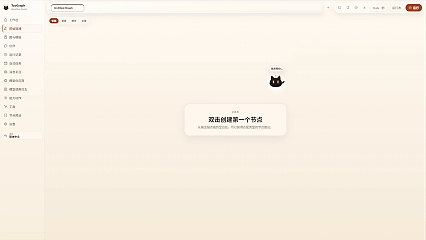

<p align="center">
  
</p>

<h1 align="center">TooGraph</h1>

<p align="center">
  面向 Agent 工作流的可视化编排、运行观察与伙伴协作工作台。
</p>

<p align="center">
  <a href="README.md">English</a>
  · <a href="README.zh-CN.md">简体中文</a>
</p>

<p align="center">
  
</p>

<p align="center">
  <a href="https://github.com/OoABYSSoO/TooGraph/blob/main/LICENSE"></a>
  
  
  
  
  
</p>

<p align="center">
  <a href="#快速开始">快速开始</a>
  · <a href="#核心能力">核心能力</a>
  · <a href="#模型-provider">模型 Provider</a>
  · <a href="#图模板">图模板</a>
  · <a href="#未来方向">未来方向</a>
</p>

<p align="center">
  YouTube 视频：待补充
  · <a href="https://space.bilibili.com/13886340">B站</a>
  · 抖音：<code>56590573478</code>
</p>

TooGraph 是一个面向 Agent 工作流的可视化编排与运行工作台。它把 graph、state、节点、数据流、顺序流、条件分支、运行记录和人工确认统一到一套可保存、可校验、可运行的 `node_system` 协议里。

项目当前由 Vue 前端、FastAPI 后端和 LangGraph 运行时组成，适合用来搭建、调试和观察基于状态流转的 Agent graph。

## 快速开始

### 环境要求

当前是源码运行方式。正式一键安装包发布前，`npm start` 不会安装系统级运行时；请先自行安装 Node.js 和 Python，并确保命令在终端中可用。

| 工具 | 要求 | 下载地址 | 用途 |
| --- | --- | --- | --- |
| Git | 最新稳定版 | https://git-scm.com/downloads | 获取代码、更新代码、提交改动 |
| Node.js | 20.9+，推荐 LTS | https://nodejs.org/en/download | 提供 `node` 和 `npm`，用于安装前端依赖、构建前端、运行 `npm start` 启动器 |
| Python | 3.11+ | https://www.python.org/downloads/ | 运行 FastAPI 后端、安装后端依赖、执行 Python Action |

Windows 用户安装 Python 时建议勾选 `Add python.exe to PATH`；安装 Git 时可以保留默认选项。安装完成后，打开一个新的终端，确认命令可用：

```bash
git --version
node -v
npm -v
python --version
```

如果系统里的 Python 命令是 `python3`，用 `python3 --version` 检查即可。TooGraph 也支持通过 `PYTHON` 环境变量指定 Python 可执行文件路径。

常用官方下载入口：

- Node.js LTS：https://nodejs.org/en/download
- Python 3.11+：https://www.python.org/downloads/

还需要准备一个可访问的模型服务：
可以登录codex的账号，可以是本地 OpenAI-compatible 网关，这里推荐使用LM studio、私有网关，或云端 Provider。模型入口在 TooGraph 的 Model Providers 页面配置，不通过启动环境变量配置。

### 安装并启动

```bash
git clone https://github.com/OoABYSSoO/TooGraph.git
cd TooGraph
npm start
```
默认地址：

- TooGraph：http://127.0.0.1:3477
- 健康检查：http://127.0.0.1:3477/health

首次需要安装依赖时，启动脚本会临时探测 npm 和 PyPI 的可用源，选择当前可达且响应更快的源用于本次安装，并在终端输出实际使用的 registry / index-url 和探测 URL。

如果你想固定自己信任的镜像源，可以继续使用 npm / pip 自身配置；启动器会把它作为候选源之一。常见示例：

```bash
npm config set registry https://registry.npmmirror.com
python -m pip config set global.index-url https://pypi.tuna.tsinghua.edu.cn/simple
```

如果系统里的 Python 命令是 `python3`：

```bash
python3 -m pip config set global.index-url https://pypi.tuna.tsinghua.edu.cn/simple
```

镜像源只影响依赖下载；TooGraph 的启动方式仍然是 `npm start`。

如果需要改端口：

```bash
PORT=3999 npm start
```

Windows PowerShell 如果拦截 `npm.ps1`，使用：

```powershell
npm.cmd start
```

如果 Python 没有加入 PATH，可以显式指定解释器：

```powershell
$env:PYTHON = "C:\ProgramData\miniconda3\python.exe"
npm.cmd start
```

PowerShell 中也可以指定项目专用 Python 环境目录：

```powershell
$env:TOOGRAPH_PYTHON_ENV = "D:\envs\toograph"
npm.cmd start
```

类 Unix 环境也可以使用 Bash wrapper：

```bash
./scripts/start.sh
```

## 当前仓库状态

- 前端：Vue 3、Vite、TypeScript、Pinia、Vue Router、Element Plus、vue-i18n。
- 后端：FastAPI、Pydantic、LangGraph、SQLite FTS、JSON 文件存储。
- 图协议：`node_system` 描述节点、状态、边、运行配置和画布布局；`state_schema` 是节点读写状态的统一来源。
- 启动方式：仓库根目录使用 `npm start`，实际执行 `node scripts/start.mjs`，构建前端后由 FastAPI 在单个端口同时服务 UI 和 API。
- 本地数据：graph、preset、run、settings、Action state、checkpoint、retrieval documents/chunks 和 embedding jobs 写入 `backend/data/`。
- 主要页面：Home、Editor、Runs、Run Detail、Settings、Model Providers、Actions、Templates、Presets、Buddy。

## 核心能力

### 可视化编辑器

- 支持 `input`、`agent`、`condition`、`output`、`subgraph` 五类核心节点。
- 通过 `state_schema` 连接节点输入和输出，区分数据流、顺序流和条件分支。
- `condition` 节点支持 true / false / exhausted 分支和循环上限配置。
- 支持画布拖拽、节点选择、连线、边删除确认、节点端口编辑、右下角缩略图、线条显示模式和运行态高亮。
- 支持从空画布、节点输出端口、流程端口和文件拖入创建节点。
- 支持多图页签、保存状态提示、未保存关闭确认、模板创建、已有图打开和运行记录恢复编辑。
- 支持编辑器内 State 面板和 Human Review 面板；图进入人工确认暂停时，画布保持可查看但不可编辑。
- 支持多语言界面：简体中文、繁體中文、English、日本語、한국어、Español、Français、Deutsch。

### 运行与观察

- 支持保存、校验、运行 graph。
- LangGraph runtime 会把可执行 graph 编译为后端运行计划，并记录状态快照、节点状态、输出预览、artifacts、warnings 和 errors。
- 支持 checkpoint、pause snapshot、completed snapshot，以及从可恢复快照继续运行。
- 支持断点暂停后的 Human Review 输入，继续运行前可以填写当前需要人工补充的 state。
- 支持 SSE/EventSource 运行事件流，Editor 可以实时更新 Run Activity 和 Output 节点预览。
- Runs 首页支持状态筛选、搜索、分页、断点结果和最终结果切换。
- Run Detail 页面展示运行概览、节点过程、循环信息、state、artifacts、输出预览和恢复编辑入口。
- 后端提供 LangGraph Python 源码导出和 Python 源码导入接口。

### 模型 Provider

TooGraph 的推荐模型配置入口是 Model Providers 页面。你可以在界面里配置本地模型网关、私有 OpenAI-compatible 网关或云端 Provider，并选择默认文本模型；这些配置写入本机设置目录，不进入 Git。

本地或私有网关的常规流程：

1. 启动你要使用的 OpenAI-compatible gateway。
2. 打开 TooGraph 的 Model Providers 页面。
3. 配置 `local` / LM Studio Provider 的 base URL、API key 和模型列表；当前本地默认 base URL 是 `http://127.0.0.1:1234/v1`。
4. 保存后，编辑器和运行时会从已保存的 Provider 配置读取模型入口。

模型运行只读取 Model Providers 页面保存的 Provider 配置和默认模型选择。启动环境变量不会配置模型入口。

### 核心思想

- 图整体才是 Agent；单个 LLM 节点只做一次模型运行，并且最多使用一个显式能力来源。
- LLM 节点可以显式选择一个 Action，存储在 `config.actionKey` 单值字段中；动态 `capability` state 是单个互斥对象，`kind` 为 `action`、`subgraph`、`tool` 或 `none`。
- 手动复用图仍通过 Subgraph 节点完成；动态 `capability.kind=subgraph` 主要服务于 Buddy 主循环这类模板内能力选择。
- 后端使用统一 retrieval substrate：`source_chunker` 负责切片，`retrieval_ingestion_writer` 负责写入 retrieval documents/chunks 和排队 embedding jobs，`retrieval_query_context_loader` 负责查询召回。

### 配置模型入口

如果需要运行 LLM 节点，先启动本地模型网关或准备云端 Provider 凭据，然后在 TooGraph 的 Model Providers 页面完成配置。只查看 UI、编辑 graph 或浏览已有运行记录时，可以先不配置模型入口。

日志写入：

- `.toograph_server.log`


Docker、单机部署、数据卷和更新流程见 [docs/README.md](docs/README.md)。

## 第一次运行一个 graph

1. 打开 http://127.0.0.1:3477。
2. 先进入 Model Providers 页面，配置至少一个可用于聊天的模型供应商。
3. 选择默认文本模型；如果要测试检索或知识库流程，也选择默认 embedding 模型。
4. 进入 Editor，新建 graph 或选择内置模板。
5. 创建 `input -> LLM -> output` 的最小流程。
6. 在 `input` 节点填写输入；如果 LLM 节点没有使用默认模型，则在 `LLM` 节点选择模型并填写提示词。
7. 点击 Run，并在运行详情页查看执行过程和输出。

## 项目结构

```text
TooGraph/
├── frontend/
│   ├── src/api/              # 前端 API 封装
│   ├── src/editor/           # 画布、节点、状态面板、工作区
│   ├── src/i18n/             # 多语言文案和 Element Plus locale 适配
│   ├── src/layouts/          # 应用壳层、侧栏、语言切换
│   ├── src/pages/            # Home / Editor / Runs / Run Detail / Settings
│   ├── src/router/           # Vue Router
│   ├── src/stores/           # Pinia stores
│   ├── src/styles/           # 全局样式和主题覆盖
│   └── src/types/            # 图协议、运行态和 API 类型
├── backend/
│   ├── app/
│   │   ├── api/              # graphs / runs / templates / presets / settings / actions / tools / buddy
│   │   ├── core/compiler/    # node_system 校验
│   │   ├── core/langgraph/   # LangGraph runtime、checkpoint、codegen
│   │   ├── core/runtime/     # 节点执行、state、输出边界工具
│   │   ├── core/schemas/     # Pydantic schemas
│   │   ├── core/storage/     # JSON 文件和 SQLite 存储
│   │   ├── actions/          # Action registry、definitions 和文件读取
│   │   ├── buddy/            # Buddy Home、会话、命令和 revision
│   │   ├── evaluator/        # 内部遗留检查模块
│   │   ├── graph_tools/      # Tool registry 和 definitions
│   │   ├── templates/        # graph 模板加载器
│   │   └── tools/            # OpenAI-compatible 调用工具
│   └── tests/                # 后端 pytest 测试
├── graph_template/           # 官方和用户自定义 graph 模板
├── node_preset/              # 官方和用户自定义节点预设
├── docs/
│   └── README.md            # 唯一长期代码事实与路线图
├── scripts/
│   ├── start.mjs             # 跨平台单端口启动器
│   ├── start.sh              # Bash 启动 wrapper
│   ├── start.cmd             # Windows 启动 wrapper
├── action/                   # 官方和用户自定义 Action 包
├── tool/                     # Tool 包目录
├── Makefile
└── README.md
```

## 图模板

官方模板位于 `graph_template/official/<template_id>/template.json`，会进入 Git 管理。前端“保存为模板”创建的是用户自定义模板，写入 `graph_template/user/<template_id>/template.json`；模板本体可以进入 Git 管理，当前环境的启用状态只写入被忽略的 `graph_template/settings.json`，缺失时程序会按现有模板自动生成和补齐。子图节点创建菜单从这两类模板中选择来源，不再直接从已保存 graph 列表创建子图。

当前可见官方模板：

- `advanced_web_research_loop`（界面名称：高级联网搜索）
- `buddy_autonomous_loop`（界面名称：伙伴自主循环）

## 未来方向

- 补齐 Buddy 原生虚拟 UI 操作的 operation journal、activity events、graph diff、revision、undo/redo、失败重试和运行结果归因。
- 增加自主复盘模板，完善 Buddy 窗口交流后的自主复盘。
- 优化上下文压缩模板。
- 扩展 Buddy 编辑已有图的能力：选择、移动、重命名、改配置、选 Action、调整连接、删除、恢复、运行和基于错误继续修复。
- 扩展页面操作书覆盖范围，让 Buddy 能跨 Action 页、运行历史、编辑器、模型日志等页面先导航再操作目标内容。
- 继续完善上下文预算、`result_package` 摘要、大 artifact 按需展开和只读 fanout 并行。
- 增加端到端 UI 测试，覆盖编辑器、运行记录、断点暂停、Buddy 虚拟操作和多语言切换。
- 继续打磨桌面端或一键安装包，进一步降低非开发环境启动成本。

## License

MIT License

## Acknowledgments

- [LangGraph](https://github.com/langchain-ai/langgraph)
- [Vue](https://vuejs.org/)
- [Element Plus](https://element-plus.org/)
- [ComfyUI](https://github.com/comfyanonymous/ComfyUI)
- [hermes-agent](https://github.com/NousResearch/hermes-agent)
