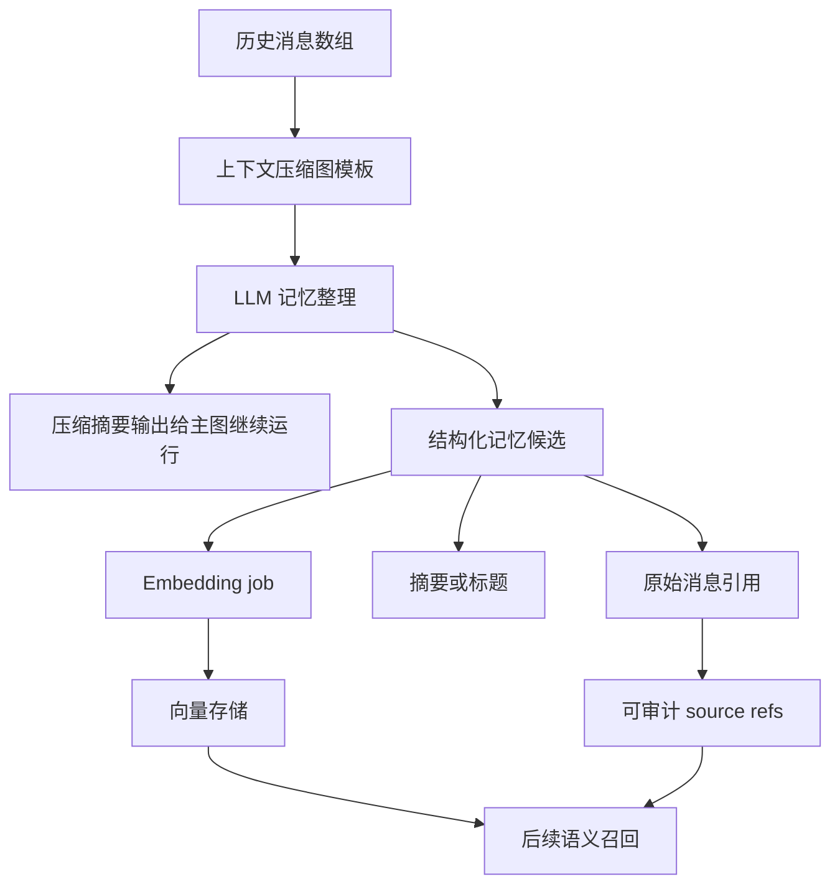

# Embedding、记忆召回与知识库设计整理

整理日期：2026-05-31

本文整理近期关于 TooGraph embedding 设计的讨论。它不是某一次实现计划，而是后续做记忆召回、知识库语义检索、模型供应商配置和上下文压缩时应遵守的产品与架构判断。

## 核心结论

- Embedding 的主要目标是服务语义检索，优先用于 Buddy 记忆召回和知识库检索。
- Embedding 模型不应作为独立于模型供应商的另一套配置体系；Provider 仍然是连接和凭据边界，Model 通过能力声明区分 `chat`、`embedding`、`rerank` 等用途。
- 召回时使用的 embedding 模型必须和生成向量时使用的模型一致。不同模型、不同维度或不同归一化规则产生的向量空间不能混用。
- Embedding 结果应该缓存并可重建。新增 embedding 模型时，可以为同一批内容追加一套新的向量，而不是覆盖旧向量。
- 记忆压缩、embedding 生成和原文引用可以在同一条图流程中被规划，但 embedding 写入适合异步执行，不阻塞 Buddy 主回复。
- 摘要可以作为图压缩后的可读输出，但不应替代原始消息引用。长期记忆和检索索引必须能回指原始 message、run、node output、artifact 或 memory source。

## 概念边界

### Chat 模型

Chat 模型用于对话、规划、总结、结构化输出和能力调用输入准备。它的输出是自然语言或结构化 JSON，通常消耗上下文窗口，并受 temperature、thinking、tool call 等配置影响。

Chat 模型可以参与“记忆整理”的判断，例如把一组历史消息拆成几类长期记忆候选、生成摘要、判断稳定性和重要性。但它不应该被当作 embedding 模型使用，除非该具体模型和接口明确支持 embedding 输出。

### Embedding 模型

Embedding 模型把文本转换成固定维度向量。它的输出不是给人阅读的答案，而是给相似度检索使用的数值表示。

Embedding 模型关注：

- `model_ref`：例如 `local/text-embedding-qwen3-embedding-8b`。
- 维度：例如 1024、1536、4096 等，必须随向量一起记录。
- 距离度量：cosine、dot product、L2 等。
- 输入规范：是否拼接 title、source、speaker、timestamp、summary；是否截断；是否归一化。
- 内容 hash：用于判断内容是否已经生成过同模型向量。

### Rerank 模型

Rerank 是检索后的重排能力，不等同于 embedding。

典型流程是：

1. 用关键词、FTS、trigram、embedding 取回一批候选。
2. 把 query 和候选片段交给 rerank 模型评分。
3. 按 rerank 分数重新排序，保留更适合进入 LLM 上下文的材料。

Rerank 可以是模型本身的能力，也可以由外部服务提供。TooGraph 中它应该和 embedding 一样表现为模型能力，而不是 Provider 级别的隐式开关。

## 模型供应商页面设计

当前采用的方向是：Provider 管连接，Model 管能力。

Provider 代表“怎么连上一个渠道”，例如：

- LM Studio / 本地 OpenAI-compatible gateway。
- OpenAI-compatible API。
- OpenAI Codex / ChatGPT 登录。
- 阿里百炼、硅基流动、OpenRouter 等未来 provider。

Model 代表该连接下的一个具体模型。每个模型可以声明能力：

- `chat`
- `embedding`
- `rerank`
- `vision`
- `tool_call`
- `structured_output`

这比“左边 LLM、右边 Embedding”或“两个页签”更适合当前产品，因为用户已经按 Provider 思考配置入口。Embedding 不会藏起来，同时也不会把连接配置拆成两套。

### 模型能力判断

第一版采用“名称自动识别 + 用户手动覆盖”。

自动识别适合处理常见模型名：

- `embedding`
- `embeddings`
- `text-embedding`
- `qwen3-embedding`
- `bge-m3`
- `jina-embeddings`
- `rerank`
- `reranker`

但模型名不是可靠协议边界，所以必须允许用户展开模型行手动修改能力。自动识别只负责减少配置成本，不负责最终事实。

### 当前选定的本地 embedding 模型

当前本地跑通流程优先使用：

```text
text-embedding-qwen3-embedding-8b
```

它应作为 LM Studio / local Provider 下的一个模型行出现，并标记为 `embedding=true`、`chat=false`。

## 记忆压缩与 embedding 的数据流

讨论中的目标流程可以这样理解：



关键点：

- 图模板接收一组历史消息数组。
- LLM 节点负责把历史消息合理拆分为若干记忆候选，例如用户偏好、项目事实、长期目标、决策记录、待办线索。
- 每个候选都应保留原始消息引用，而不是只保存压缩文本。
- 主图需要继续运行时，可以只拿压缩摘要或上下文包，不必等待 embedding 完成。
- Embedding 生成适合进入异步 job：写入待处理任务，后台生成向量，完成后更新检索索引。
- 后续召回时，结果必须能解释“为什么召回”：向量分数、关键词分数、rerank 分数、source refs、摘要或片段。

## 摘要是否需要由压缩图输出

讨论过两种做法。

### 做法 A：压缩图直接输出 summary

优点：

- 主图可以马上拿到一个可读、短小、稳定的上下文。
- Buddy 回复路径简单，压缩节点的产物就是后续 LLM 的输入。
- 便于用户在 run detail 中审计：“这次压缩后主图实际看到了什么”。

缺点：

- 如果 summary 同时承担“长期记忆正文”和“主图临时上下文”，容易混淆用途。
- 摘要写得不好会影响当前回复，但不一定适合作为长期记忆。
- 可能让后续节点失去按类型、来源、重要性重新组织上下文的自由度。

### 做法 B：压缩图只输出结构化块，summary 由后续节点拼

优点：

- 记忆候选、原始引用、重要性、标签、embedding job 可以更结构化。
- 后续节点可以按预算、任务类型和权限边界决定怎么拼上下文。
- 更适合长期演化成 context package 和可解释召回系统。

缺点：

- 主图多一个上下文组装步骤。
- 用户审计时要看“结构化块 + 拼接规则”，理解成本更高。
- 第一版实现复杂度略高。

推荐折中：

- 压缩图输出一个给主图用的短 summary，保证可见回复路径轻量。
- 同时输出结构化记忆候选，包含摘要字段、原始消息引用、标签、重要性和 embedding job 输入。
- 长期检索不要只依赖 summary。summary 是可读投影，原始引用才是事实来源。

## 记忆与知识库是否分开 embedding 配置

第一版不需要强迫用户分开配置。

原因：

- 用户当前的真实目标是“语义检索能跑通”，不是做复杂检索策略矩阵。
- 记忆和知识库都可以先使用同一个默认 embedding 模型。
- 模型行上可以提供适用范围开关：`use_for_memory`、`use_for_knowledge`。
- 未来如果质量要求不同，再引入高级配置，例如 `memory_embedding_model_ref` 和 `knowledge_embedding_model_ref`。

需要分开的不是第一版 UI，而是数据语义层：

| 维度 | 记忆 | 知识库 |
| --- | --- | --- |
| 来源 | Buddy 消息、run、用户修正、长期偏好 | 文档、网页、项目资料、导入文件 |
| 更新方式 | 会话后复盘、用户确认、低风险写回 | 文档导入、增量索引、rebuild |
| 风险 | 错误记忆会影响长期行为 | 错误引用会影响事实回答 |
| 审计重点 | source message、revision、memory event | citation、document id、chunk id |

## 向量缓存与多模型并存

Embedding 生成有成本，所以应该存储。

成本包括：

- API 调用费用。
- 本地模型推理时间。
- GPU / CPU 占用。
- 大批量文档索引时的等待时间。

推荐存储维度：

- `embedding_model_ref`
- `provider_id`
- `model`
- `dimensions`
- `distance_metric`
- `input_hash`
- `source_kind`
- `source_id`
- `chunk_id`
- `vector`
- `created_at`
- `status`

当新增一个 embedding 模型时，不要覆盖旧向量。可以为同一内容生成新的向量集合，并在召回配置里选择使用哪一套。

当内容变更时，使用 `input_hash` 判断是否需要重建。未变更内容无需重复生成。

当 embedding 模型切换时，应标记相关记忆或知识库索引需要 rebuild，而不是把不同模型的向量混在一起算相似度。

## 召回一致性规则

最重要的规则：

```text
生成向量用什么 embedding 模型，查询向量就必须用同一个 embedding 模型。
```

允许的情况：

- 旧索引用 `model_a`，新索引用 `model_b`，两套索引并存。
- 用户选择 `model_b` 后，后台逐步为历史内容补建 `model_b` 向量。
- 在 `model_b` 索引不完整时，显式 fallback 到关键词检索或旧索引，并在召回结果中标明。

不允许的情况：

- 查询向量用 `model_b`，候选向量来自 `model_a`，但仍直接比较。
- 只因为模型名相似就认为向量空间兼容。
- 模型维度不同但强行截断、补零或混排。

## Provider 与渠道能力判断

未来不要把“某个渠道一定支持 embedding”写死为产品规则。

更稳的判断方式：

- Provider 只说明连接协议和凭据。
- Model 行说明能力。
- 实际调用时通过 Provider client 请求 `/embeddings`、rerank endpoint 或相应 provider-specific API。
- 成功和失败都进入 model logs、indexing job details 或 run audit。

OpenAI-compatible provider 是否支持 embedding，取决于它背后的服务是否实现 embedding endpoint，以及选中的模型是否支持 embedding。LM Studio、本地网关、云 API 都应按这个原则处理。

## 与 Hermes 方式的取舍

Hermes 风格通常强调 agent 自治循环、记忆召回、工具调用和自我改进。TooGraph 不应照搬隐藏 agent loop，而应把这些能力翻译成可审计图流。

TooGraph 推荐方式：

- LLM 节点做一次判断或结构化规划。
- Action / Tool / Subgraph 执行一次明确能力。
- 记忆写入、embedding job、知识库索引都通过可审计节点或后台图产生。
- 结果有 source refs、revision、job status、warnings 和可回放 run record。

这比隐藏式 Hermes loop 更适合 TooGraph，因为 TooGraph 的核心优势是图优先、可检查、可回放、可审批。

## 推荐的第一阶段落地顺序

1. 在 Model Providers 中完成模型能力配置：chat、embedding、rerank 等。
2. 让默认运行模型只选择 `chat` 模型，避免 embedding-only 模型进入聊天路径。
3. 为 embedding 模型保存 `dimensions`、`use_for_memory`、`use_for_knowledge`。
4. 建立默认检索 embedding 模型选择，第一版可以共用于记忆和知识库。
5. 将记忆压缩图输出拆成两类：主图继续运行所需 summary，以及后台写入/索引用结构化候选。
6. Embedding 写入异步 job，不阻塞主回复。
7. Retrieval 结果必须返回分数、来源引用和使用的 embedding 模型。
8. 后续再引入 rerank，提高召回质量和上下文预算利用率。

## 开放问题

- `text-embedding-qwen3-embedding-8b` 的最佳 dimensions 是否固定，还是允许服务端默认。
- 是否需要在 UI 上提供全局 `default_embedding_model_ref`，还是先只在模型行上标记用途。
- 记忆候选的 chunk 粒度：按消息、按主题块、按 LLM 分段，还是混合。
- 压缩 summary 是否需要版本化，以便用户查看某次主图到底收到了什么压缩上下文。
- Rerank 第一版是只作为能力标记，还是直接接入知识库和记忆召回流程。
- 本地 embedding job 是否需要并发、限速和暂停机制，避免和本地聊天模型抢 GPU。

