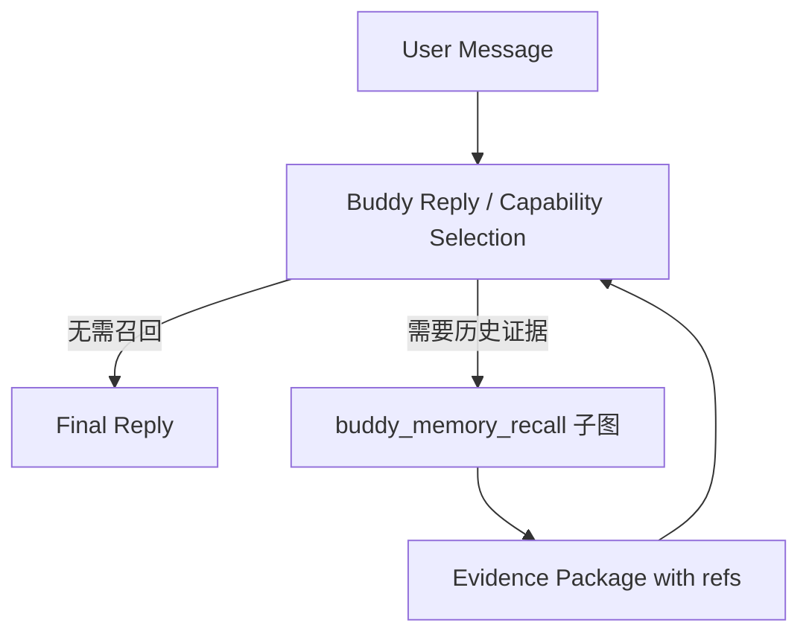
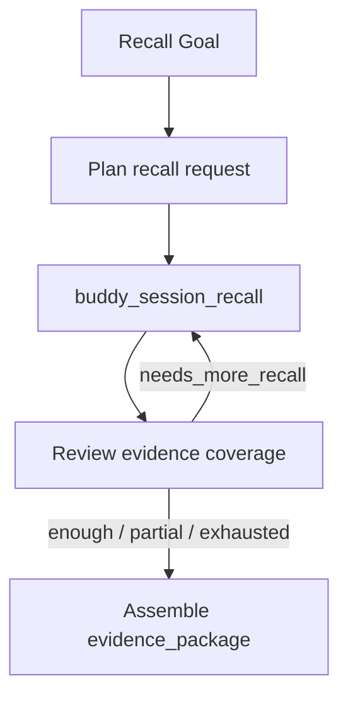
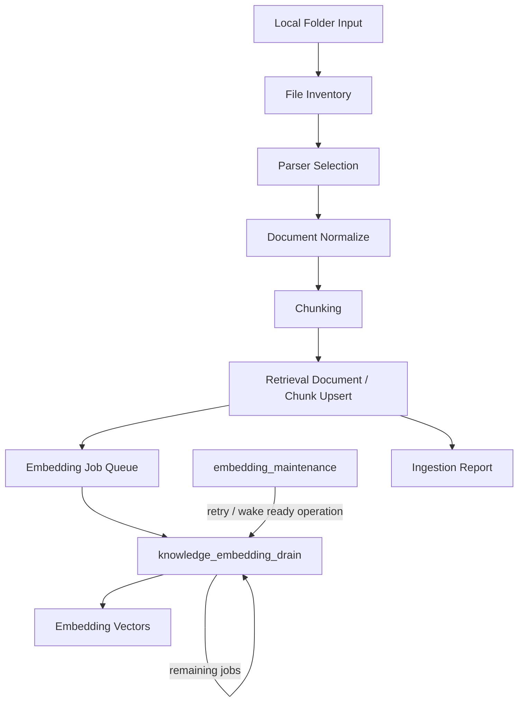
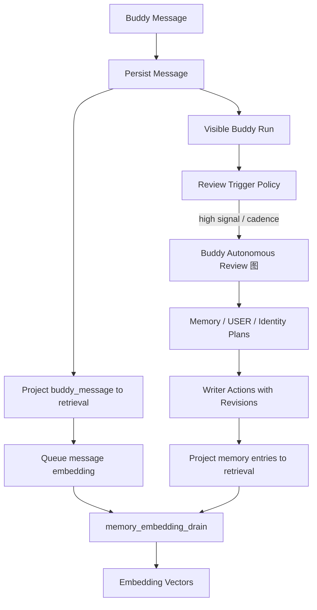
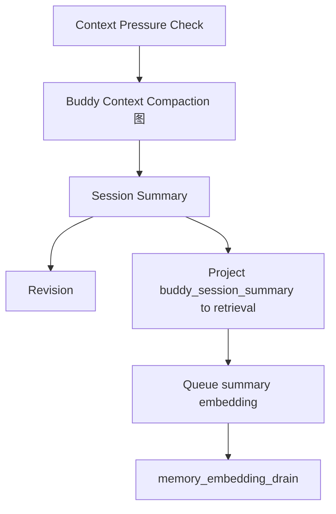
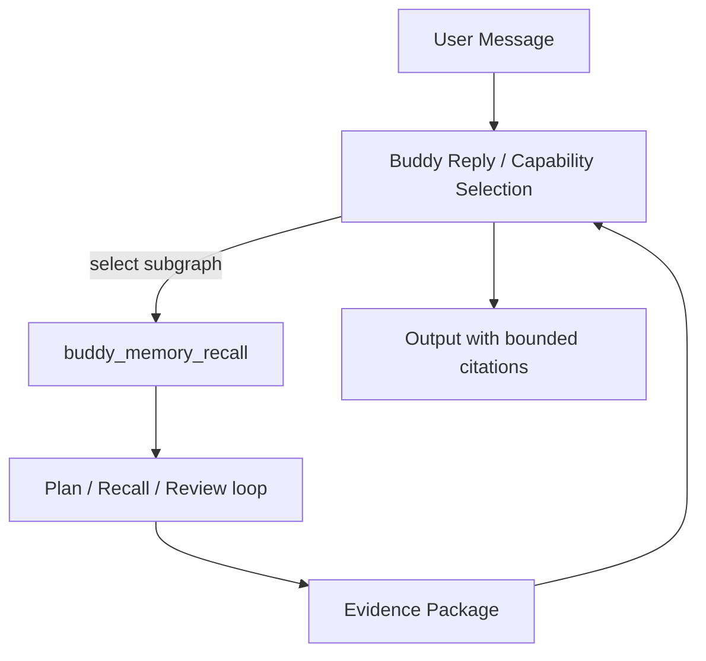

# Embedding 与 Retrieval 生命周期设计

整理日期：2026-06-03

本文是 TooGraph 中 embedding、retrieval、聊天记忆召回、上下文压缩和知识库入库的唯一全局设计参考。任何旧的 embedding 讨论、专项 RAG 打磨笔记或历史实现计划，如果与本文冲突，以本文为准。

维护约束：

- 不再新增平行的 embedding 总体设计文档。
- 场景模板可以写自己的业务说明，但不能重新定义 embedding、retrieval、memory、knowledge ingestion 的全局边界。
- 历史 spec 中仍有价值的表结构或迁移细节可以保留为历史材料；做新设计和实现时只从本文引用全局原则。
- 代码、官方模板 JSON、Action manifest 和测试仍是当前实现事实来源；本文描述目标架构和演进方向。

## 核心判断

Embedding 不是记忆系统，也不是知识库系统。Embedding 是 retrieval substrate 的一部分，用来把文本 chunk 转成可检索的向量表示。

TooGraph 的目标不是“在聊天时顺手存一点 embedding”，而是用图模板表达完整的知识生命周期：

```text
输入
-> source package
-> normalize / parse
-> retrieval document
-> retrieval chunk
-> FTS / vector / metadata index
-> retrieval query
-> context package
-> Buddy、Agent 或业务模板消费
```

长期记忆、会话摘要和知识库都可以进入同一套 retrieval substrate，但它们不是同一种业务对象。入库、压缩、复盘、召回应由不同图模板表达，不应混成一个隐藏后端流程。

## 三层结构

理想系统分为三层。

### 1. 原始材料层

原始材料是事实源，必须可追溯、可重建、可审计。

典型来源包括：

- Buddy 聊天消息。
- Buddy session summary。
- Buddy background review source run snapshot。
- structured memory entry。
- Buddy Home 文档投影。
- 知识库文件、文件夹、网页、PDF、Word、Markdown、代码文件。
- 图运行输出、node summary、artifact metadata。

原始材料进入图时应被包装成显式 source package，而不是直接塞进 LLM prompt。文件夹输入必须保持可检查选择包，例如 `kind=local_folder`、选中文件列表、过滤规则、扫描时间和 source refs。

### 2. 检索索引层

检索索引层是派生层，可以删除后重建。

核心对象：

- `retrieval_documents`
- `retrieval_chunks`
- `retrieval_chunks_fts`
- `retrieval_chunks_fts_trigram`
- `embedding_models`
- `embedding_jobs`
- `embedding_vectors`
- `retrieval_queries`
- `retrieval_results`

检索索引层负责：

- 将不同 source 统一投影为 document 和 chunk。
- 保存 chunk 的 source locator、metadata、content hash 和 revision。
- 为启用的 embedding model 创建 job。
- 保存向量、模型、维度、距离度量和 content hash。
- 记录每次 query、filter、score、rerank 和 omission reason。

### 3. 语义记忆层

语义记忆层不是所有聊天历史的镜像，而是经过复盘、筛选、确认或高置信规则提炼出的长期上下文。

它包括：

- `memory_entries`
- `MEMORY.md`
- `USER.md`
- Buddy identity / tone / behavior preferences
- capability usage stats
- improvement candidates

语义记忆可以被投影回 retrieval substrate，支持后续召回。但它的写入必须经过后台复盘图、受控 writer Action、revision 和 audit，不应由 embedding job 自动产生。

## 图模板分工

Embedding 和 retrieval 的理想形态必须用图模板表达。

### Embedding Ingestion 图

Embedding Ingestion 图负责信息入库。

输入：

- local folder package。
- 文件列表或单个文件 artifact。
- Buddy message batch。
- session summary。
- structured memory entry。
- graph run snapshot。
- knowledge base import batch。

输出：

- normalized source package。
- retrieval document records。
- retrieval chunk records。
- embedding job records。
- index status。
- failure report。
- audit refs。

职责边界：

- 不负责回答用户问题。
- 不负责决定什么是长期记忆。
- 不直接修改 Buddy persona、USER.md 或 MEMORY.md。
- 不把大型文件内容塞进长期 state。
- 不把 embedding 生成失败隐藏成成功入库。

### Retrieval Query 图

Retrieval Query 图负责信息召回。

输入：

- user_message。
- conversation_history context package。
- session_summary。
- Buddy Home context。
- source filters。
- retrieval strategy。
- embedding_model_ref。
- reranker_model_ref。

输出：

- context package。
- citations / source refs。
- ranking report。
- omitted reasons。
- query audit id。

职责边界：

- 不写长期记忆。
- 不改知识库。
- 不把召回内容提升为系统指令。
- 不隐藏检索过程。
- 不直接决定最终回复，除非该图本身就是问答模板的一部分。

### Buddy Memory Review 图

Buddy Memory Review 图负责从完成的可见 Buddy run 中整理长期记忆和低风险自配置候选。正式入口由 `buddy_review_source_selector` Tool 选择复盘来源：定时运行默认使用 `auto_unreviewed`，自动探测尚未复盘的 completed Buddy run；手动复盘可以把 selector 切到 `explicit` 并提供 source run。`source_run_id` 是 selector 输出，不是调度器通过空值触发的隐式输入。

输入：

- review_source_selection_mode。
- selected source_run_id。
- completed run snapshot。
- user_message。
- public_response。
- capability_result。
- conversation_history。
- recalled related sessions。
- Buddy Home context。

输出：

- memory_update_plan。
- user_context_update_plan。
- structured_memory_update_plan。
- buddy_identity_update_plan。
- capability_usage_update_plan。
- improvement candidates。
- applied/skipped commands。
- revision ids。

职责边界：

- 自动写入只限低风险内容。
- 高风险内容进入 candidate 或人工 review。
- 不把一次性任务状态、错误日志、密钥、临时路径、大 artifact、base64 或可从项目文件重读的信息写成长期记忆。
- 不拥有自己的隐藏 agent loop，必须是可审计图运行。

### Buddy Context Compaction 图

Buddy Context Compaction 图负责缓解当前会话上下文压力。

输入：

- conversation_history context package。
- current_session_id。
- source_run_id。

输出：

- session_summary_candidate。
- protected_recent_history。
- compaction_report。
- session_summary.update writer command。
- revision id。

职责边界：

- 只压缩会话历史。
- 不摘要当前 user_message、Buddy Home、capability_result 或 public_response，除非它们显式进入该子图输入。
- 不直接写长期记忆。
- 不修改 USER.md、MEMORY.md、Buddy identity 或权限设置。
- 写出的 session summary 应投影为 `buddy_session_summary` retrieval source，并可进入 embedding job。

### Knowledge Ingestion 图

Knowledge Ingestion 图负责知识库文件夹或文件批量入库。

输入：

- local folder package。
- file selection。
- parser profile。
- chunking strategy。
- knowledge base id。
- embedding model policy。

输出：

- document records。
- structured chunks。
- source locator。
- embedding jobs。
- skipped files。
- parse warnings。
- rebuild report。

职责边界：

- 与聊天记录入库分开模板。
- 可以共用 retrieval primitives。
- 不写 Buddy 长期记忆。
- 不把文件夹扫描隐藏在 Buddy 回复路径里。
- 大批量 embedding 异步执行，不阻塞前台回复。

## Embedding 队列执行分层

`embedding_jobs` 是统一队列表，但执行图必须按来源分 lane，避免知识库导入、聊天记忆和队列恢复互相混淆。

### `knowledge_embedding_drain`

知识库向量生成由 `knowledge_embedding_drain` 处理。它的输入是 `collection_id` 与 `operation_id`，只处理 `source_kind=knowledge_document` 的 jobs。它不是“每隔一段时间处理一点”的维护任务，而是 operation scoped drain：一次 run 有内部批次上限和时间预算；如果 run 成功且仍有剩余 jobs，调度器继续触发同一个事件，让该 operation 尽快跑完。遇到 provider 不可用、超时或模型暂不可用时，jobs 进入 retry_wait / blocked，知识库页面应显示进度和最后错误。

### `memory_embedding_drain`

记忆向量生成由 `memory_embedding_drain` 处理。它只消费 `buddy_message`、`buddy_session_summary` 和 `memory_entry` 来源。触发来源包括消息入库、会话压缩摘要入库、后台复盘写入结构化记忆后产生的 ready jobs，以及队列维护唤醒。记忆 drain 可以使用较小的 `job_limit` 和时间预算，避免后台记忆索引长期占用模型服务。

### `embedding_maintenance`

`embedding_maintenance` 的正式语义是队列维护，不直接生成 embedding vectors。它定期恢复过期 running jobs、重置可重试 failed jobs、同步知识库 indexing operation 状态，并发现 ready 的知识库 operation 或记忆 jobs，然后通过标准事件触发对应 drain 图。它的价值是恢复、接力和可观测性，而不是替代来源专用 drain。

## 聊天记录和知识库为何分开模板

聊天记录和知识库共享底层 retrieval substrate，但业务策略不同。

聊天记录入库关心：

- role。
- session_id。
- client_order。
- message_id。
- run_id。
- current session lineage 排除。
- include_in_context。
- 隐私和临时上下文。
- session summary 与 long-term memory 的边界。

知识库入库关心：

- file path。
- file type。
- content hash。
- document version。
- section / heading / page / code symbol。
- parse status。
- delete sync。
- rebuild。
- bulk job progress。

因此：

```text
同一底座，不同模板。
同一 retrieval contract，不同 source policy。
```

## 上下文压缩、入库和记忆复盘的关系

三者必须分开。

### 每轮聊天消息入库

每轮 Buddy 消息都可以被确定性保存为 `buddy_message`，并投影到 retrieval index。启用 embedding 模型时，为该 message chunk 创建 embedding job。

这一步只是原始材料入库，不是长期记忆写入。

### 上下文压缩

当上下文压力达到阈值时，Buddy 主循环运行 compaction 图。该图写 `session_summary`，用于当前会话继续运行，并保留 source refs。

`session_summary` 应成为一等 retrieval source：

```text
source_kind = buddy_session_summary
source_id = summary_id
source_revision_id = revision_id
content = summary content
metadata = session_id, lineage_root_session_id, source_run_id
```

它应进入 FTS、trigram、embedding jobs 和 retrieval audit。

### 后台复盘

后台复盘的目标是把高信号对话整理成长期记忆或自配置候选。它不应该由压缩自动替代。

推荐触发：

- 用户明确表达“记住”“以后都”“不要再”。
- 用户纠正 Buddy 的风格、工作流、格式或长期偏好。
- 当前 run 使用能力并产生可复用经验。
- 上下文压缩发生且摘要有实质变化。
- 普通对话累计约 8 到 10 个 user turns。
- scheduler 按 cadence 运行 `buddy_autonomous_review`，由 `buddy_review_source_selector` 自动选择尚未复盘的 completed Buddy run。
- 用户在 Run Detail 手动触发复盘。

不推荐触发完整复盘：

- 寒暄。
- 简单感谢。
- 单句状态确认。
- 没有新信息的短回复。
- 被中断或失败的 run，除非专门做失败复盘。

低信号 run 可以记录 skipped audit，而不是运行完整 LLM 复盘。

## Hermes 参考的正确翻译

Hermes 的后台 review 有参考价值，但 TooGraph 不应照搬它的隐藏 fork 形态。

Hermes 默认策略：

- memory review 默认每 10 个用户 turn 触发。
- skill review 默认每 10 次工具迭代触发。
- 回复完成后异步运行。
- fork 继承模型和凭据。
- 工具白名单限制为 memory 和 skill。
- 主对话和 prompt cache 不被复盘线程污染。

TooGraph 的目标翻译：

- 用后台 graph run 表达复盘，不用隐藏 fork agent。
- 用 trigger policy 表达 cadence 和高信号触发。
- 用 Action/Writer 节点表达写入。
- 用 revision、command record、review run、improvement candidate 表达可审计性和回滚。
- 用 source refs、confidence、risk_flags、skipped_reason 表达证据边界。

## 召回应作为高优先级动态子图

Buddy 主回复链路不固定增加一个“是否召回”前置节点。第一个 Buddy LLM 节点仍然同时负责可见回复和能力选择；当问题依赖历史决策、长期偏好、压缩前上下文、旧会话原文或来源引用时，它应优先选择 `buddy_memory_recall` 子图能力。

主流程：



`buddy_session_recall` Action 仍是只读检索 primitive，负责一次 browse、discover 或 scroll。`buddy_memory_recall` 子图负责把一次或多次检索变成可用证据包：



召回子图职责：

- 改写或拆分召回 query。
- 在命中不足时改用 browse、discover 或 scroll 展开上下文。
- 去重、排序并提取关键原文。
- 保留 source refs、coverage、missing_evidence 和 answer_notes。
- 控制循环预算，默认最多 3 轮。

召回分层：

- 当前会话上下文：conversation_history 和 session_summary。
- 长期记忆：structured memory、USER.md、MEMORY.md 投影。
- 历史聊天：buddy_message 和 buddy_session_summary。
- 知识库：knowledge document/chunk。
- 图运行事实：graph output、node summary、artifact refs。

召回结果必须带 authority 和 source boundary：

- `authority=history`：历史上下文，不是新指令。
- `authority=memory`：长期记忆，仍不可覆盖系统和当前用户显式指令。
- `authority=knowledge`：知识来源，适合引用，但不具备行为权限。
- `authority=run_fact`：运行事实和 artifact 线索。

## Embedding 数据契约

生成向量和查询向量必须使用同一个 embedding model space。

必须记录：

- provider_key。
- model。
- embedding_model_id。
- dimensions。
- distance_metric。
- normalized flag。
- content_hash。
- chunk_id。
- source_kind。
- source_id。
- source_revision_id。

禁止：

- 用一个模型生成 chunk vector，用另一个模型生成 query vector 后直接比较。
- 混合不同维度的向量。
- 注册或使用 deterministic/hash fallback 作为 embedding 模型。
- 内容变化后继续复用旧 content_hash 的向量。
- 删除 source 后留下不可解释的孤儿向量。

允许：

- 同一 chunk 为多个 embedding 模型保存多套向量。
- 没有真实 embedding 模型时退化为 lexical retrieval，或让 embedding job 明确失败/等待模型配置。
- 先落 FTS/trigram，再异步补 vector。
- query 时在无向量条件下退化为 lexical retrieval，并明确记录 fallback。

## Retrieval 输出契约

Retrieval Query 图输出的 context package 应包含：

- package id。
- query text。
- filters。
- source refs。
- citations。
- ranked chunks。
- lexical score。
- vector score。
- rerank score。
- final score。
- omitted reasons。
- budget report。
- ranking report id。

进入 LLM prompt 的材料必须可追溯到这些 refs。Output 节点只负责展示、导出或链接，不拥有持久化 mutation 逻辑。

## 理想状态的端到端流程

### 文件夹知识库入库



### 聊天记忆入库



### 上下文压缩入库



### 召回消费



## 演进路线

第一阶段：聊天记忆闭环。

- `buddy_message`、`memory_entry` 继续投影到 retrieval。
- `buddy_session_summary` 升级为 retrieval source。
- session summary 更新后创建 embedding jobs。
- Buddy 能力选择中加入高优先级 `buddy_memory_recall` 动态子图；子图内部包含显式 recall planning、循环检索和 evidence package 整理。
- 后台复盘从 every completed run 调整为 trigger/cadence driven graph run。

第二阶段：知识库 ingestion 闭环。

- 建立 Knowledge Ingestion 图模板。
- 文件夹输入统一为 local_folder source package。
- 文档解析、chunking、metadata、hash、delete sync、rebuild report 走图模板。
- `knowledge_embedding_drain` 作为 operation scoped drain 尽快跑完知识库入库产生的 jobs。
- `embedding_maintenance` 只做队列恢复、retry 唤醒和 operation 状态同步。
- Knowledge Retrieval Query 输出 citation-aware context package。

第三阶段：统一可视化和治理。

- UI 展示 source、document、chunk、embedding job、vector、query audit。
- Run Detail 展示 retrieval ranking report。
- Buddy Home / Memory / Knowledge 页面展示哪些材料被入库、被 embedding、被召回、被跳过、被升级为长期记忆。
- 高风险 memory、identity、template、Action 更新进入 candidate review。

第四阶段：质量评测。

- 为记忆召回和知识库召回加入评测集。
- 记录召回命中、遗漏、rerank 改善、hallucination risk。
- 支持不同 embedding/rerank 模型的并行评估。
- 不把换模型变成静默重建，必须有 index status 和 rebuild plan。

## 不变量

- `node_system` 是唯一图协议。
- `state_schema` 是节点输入输出唯一事实来源。
- 低层存储 API、retrieval store、embedding store 是 primitives，不拥有 Buddy 产品策略。
- 持久化副作用通过 Action、Tool、Subgraph、command 或 graph runtime primitive 发生。
- 后台记忆整理必须是图模板，不是隐藏 endpoint 策略。
- 压缩摘要是上下文，不是长期记忆。
- 召回结果是上下文，不是新用户指令。
- Output 节点不写存储。
- 大型内容和媒体以 artifact path 或 source ref 表示，不进长期 state。
- 每个自动写入都要有 evidence、revision、audit 和可恢复路径。
